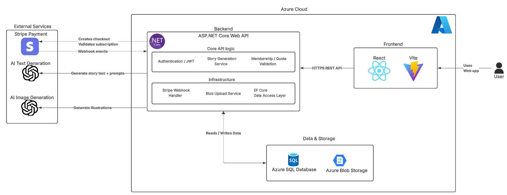

# Starlit Stories

Starlit Stories is a full-stack SaaS application for generating personalized children's storybooks with AI. We built it as a portfolio-quality product system rather than a demo: a React frontend, a .NET API, persistent data models, Stripe billing, AI generation, and cloud-oriented infrastructure concerns all live in the same repository.

This repository is shared for engineering review and portfolio evaluation. It is licensed restrictively and is not intended as a reusable starter project.

## Project snapshot

- Personalized story generation with AI-authored text and generated illustrations
- JWT-based account system with signup, login, verification, and password reset flows
- Membership plans, quotas, add-on credits, and Stripe billing workflows
- Saved-character system with plan-based entitlements
- Public story sharing and profile/story history
- Operational endpoints for health, readiness, warm-up, and sitemap generation

## What this project demonstrates

- End-to-end product engineering across frontend, backend, data, billing, and cloud integrations
- Production-oriented API work including auth, rate limiting, readiness checks, and webhook idempotency
- Entitlement modeling for membership plans instead of simple UI gating
- Integration work with OpenAI, Stripe, Azure Key Vault, Azure Blob Storage, and email providers
- Separation of concerns across API controllers, services, options, domain models, and frontend pages
- Test coverage around API and domain behavior

## Stack

- Frontend: React 19, React Router 7, Vite 6, Axios, Stripe Elements
- Backend: ASP.NET Core 8, Entity Framework Core, SQL Server, JWT auth
- Integrations: OpenAI, Stripe, Azure Key Vault, Azure Blob Storage, SMTP / Azure Communication Services
- Testing: MSTest, `Microsoft.AspNetCore.Mvc.Testing`, EF Core InMemory

## System architecture

## Repository structure

- `Hackathon-2025/`: primary API project and embedded frontend
- `Hackathon-2025/ClientApp/`: React application
- `Hackathon-2025.Tests/`: backend tests
- `Jobs.WebhookPruner/`: scheduled cleanup job for webhook fence records
- `docs/`: supporting technical documentation

## Notable implementation details

- Story generation supports both synchronous completion and async progress streaming over Server-Sent Events
- Stripe webhooks are handled with persisted idempotency fences via `ProcessedWebhook`
- Membership rules drive quotas, story length access, and saved-character limits
- Startup configuration is options-bound and validated early
- Secrets are designed around Azure Key Vault rather than hardcoded environment assumptions

## Engineering scope

- Auth and identity flows
- Story creation and viewing flows
- Billing and subscription lifecycle handling
- Data persistence and migrations
- Cloud storage for generated images
- Operational health and deployment-oriented endpoints

## License

This repository is available for review and discussion under the terms in [LICENSE.md](/f:/Projects/Hackathon-2025/LICENSE.md).
